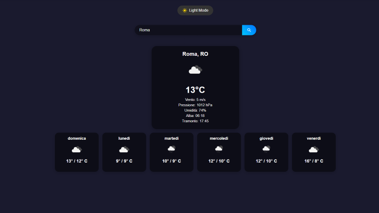
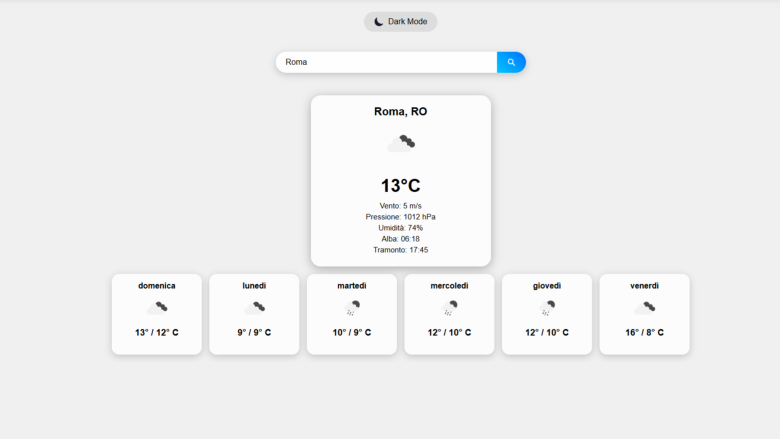

# 🌤 Weather App

Una moderna applicazione meteo realizzata in **React**, che permette di cercare città in tutto il mondo e visualizzare il meteo attuale e le previsioni dei prossimi giorni in maniera **interattiva e responsive**.  

---

## **Funzionalità principali**

- Ricerca città con suggerimenti automatici usando l’API OpenWeather **Geo API**.  
- Visualizzazione del meteo attuale con:  
  - Temperatura cliccabile per convertire tra **Celsius, Fahrenheit e Kelvin**.  
  - Pressione atmosferica cliccabile tra **hPa, atm e mmHg**.  
  - Velocità del vento cliccabile tra **m/s e km/h**.  
  - Umidità, alba e tramonto.  
  - Icona meteo ufficiale di OpenWeather.  
- Previsioni meteo dei prossimi giorni con layout **orizzontale e responsive**.  
- Modalità **Dark/Light** automatica basata sull’orario o selezionabile manualmente.  
- Design moderno con **card interattive** e **scroll snapping** per il forecast.  
- Supporto completo per **mobile e desktop**.

---

## **Screenshot dell’app**

### **Dark Mode**



### **Light Mode**



## **Tecnologie utilizzate**

- React  
- CSS moderno con Flexbox e media queries  
- OpenWeather API (Current Weather + 5-day Forecast + Geo API)  

---

## **Installazione e Avvio**

1. Clona la repository:

```bash
git clone https://github.com/NovaFenice/weatherapp.git
cd weatherapp
```

2. Installa le dipendenze:

```bash
npm install
```

3. Avvia l'app in modalità sviluppo:

```bash
npm start
```

- L'app sarà avviata su ```http://localhost:3000/```
- Assicurati di avere una chiave API valida di OpenWeather

4. Compila per la produzione:

```bash
npm run build
```

- La cartella ```build/``` conterrà la versione ottimizzata pronta per il deploy

## **Struttura dei componenti React**

- ```App.jsx``` Contiene il tema globale e gestisce la città selezionata.
- ```SearchBar.jsx``` Barra di ricerca con suggerimenti automatici
- ```Weather.jsx``` Mostra il meteo attuale della città selezionata
- ```Forecast.jsx``` Mostra le previsioni dei prossimi giorni in orizzontale
- CSS dedicati per ciascun componente (```App.css```, ```SearchBar.css```, ```Weather.css```, ```Forecast.css```)

## **API Keys**
- **OpenWeather:** [https://openweathermap.org/api](https://openweathermap.org/api)
- **Necessarie:** ```Current Weather, Forecast 5 giorni e Geo API```

## **Contributi**
- Contributi e suggerimenti sono benvenuti!
- Apri una pull request o segnala un issue per miglioramenti o bug
